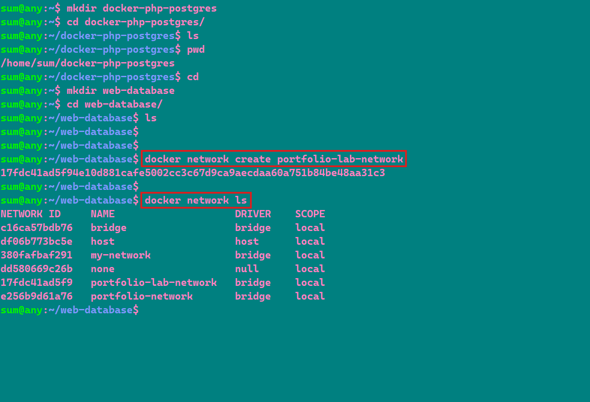
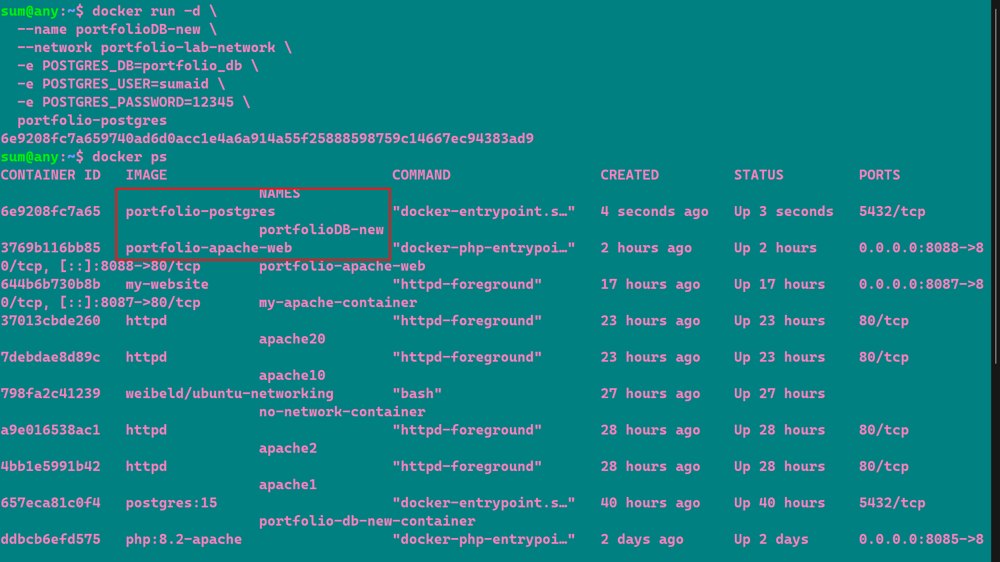
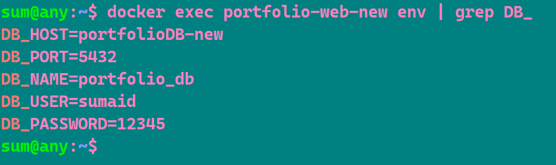
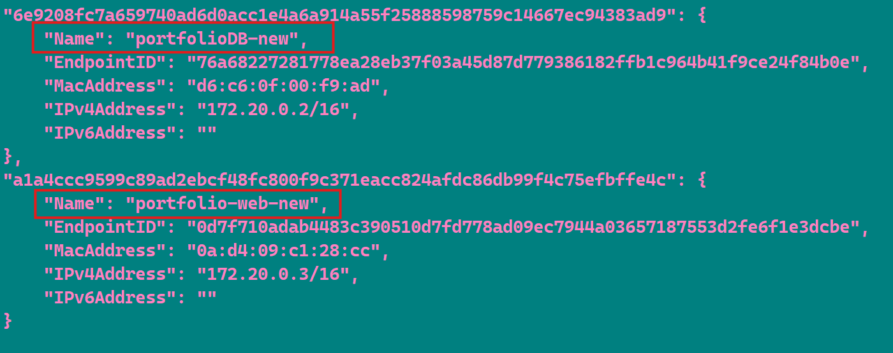
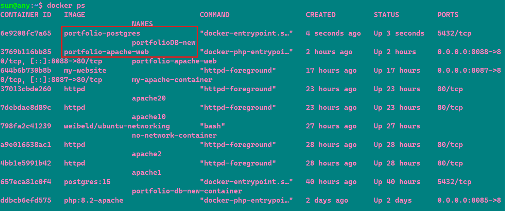
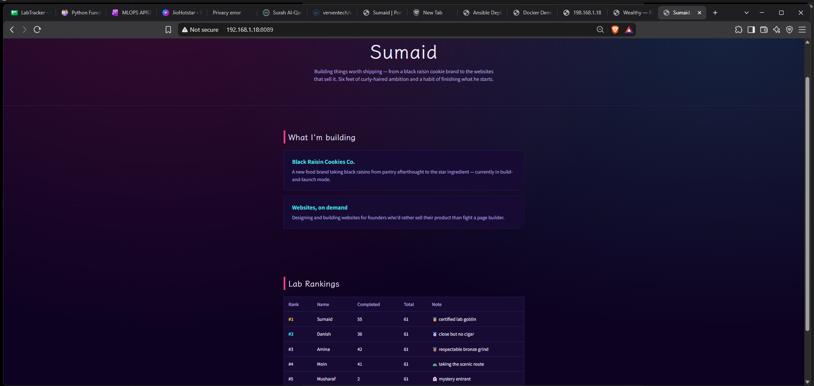

# 🐳 Docker PHP + Apache + PostgreSQL Lab

A simple Docker lab where a PHP + Apache web application connects to a PostgreSQL database using a custom Docker network.

---

## 🏗️ Architecture

    Browser
       │
       ▼
    PHP + Apache Container
    portfolio-web-new
       │
       │ Docker Network
       ▼
    PostgreSQL Container
    portfolioDB-new
       │
       ▼
    portfolio_db
       │
       ▼
    verventech_leaderboard

---

## 📁 Project Structure

    docker-php-postgres-lab/
    ├── web/
    │   ├── Dockerfile
    │   └── index.php
    │
    └── database/
        ├── Dockerfile
        └── init.sql

---

# 🚀 Setup

## 🌐 Step 1 — Create Docker Network

Create a custom Docker network so the PHP and PostgreSQL containers can communicate using container names.

    docker network create portfolio-lab-network

Check the network:

    docker network inspect portfolio-lab-network

---

# 🐘 Step 2 — PostgreSQL Database

## PostgreSQL Dockerfile

File:

    Dockerfile

    FROM postgres:15

    COPY init.sql /docker-entrypoint-initdb.d/init.sql

The official PostgreSQL 15 image is used as the base image.

The `init.sql` file is automatically executed when the PostgreSQL container is initialized.

.png>)
---

## 🗄️ Step 3 — Build PostgreSQL Image

    docker build -t portfolio-postgres 

---

## ▶️ Step 4 — Run PostgreSQL Container

    docker run -d \
      --name portfolioDB-new \
      --network portfolio-lab-network \
      -e POSTGRES_DB=portfolio_db \
      -e POSTGRES_USER=sumaid \
      -e POSTGRES_PASSWORD=12345 \
      portfolio-postgres

Check the running container:

    docker ps

---

# 🗃️ Database Structure

The database contains the `verventech` table and the `verventech_leaderboard` view.

The table stores:

- Student name
- Completed labs
- Total labs
- Ranking

The view calculates the remaining labs and adds commentary.

---

## 🔍 Verify PostgreSQL

Check whether PostgreSQL is accepting connections:

    docker exec portfolioDB-new pg_isready -U sumaid -d portfolio_db

Query the leaderboard:

    docker exec portfolioDB-new psql -U sumaid -d portfolio_db -c "SELECT * FROM verventech_leaderboard;"

.png>)

---

# 🌐 PHP + Apache

## PHP Dockerfile

File:

    Dockerfile

    FROM php:8.2-apache

    RUN apt-get update && apt-get install -y libpq-dev \
        && docker-php-ext-install pgsql pdo_pgsql

    COPY index.php /var/www/html/

    RUN chown -R www-data:www-data /var/www/html \
        && chmod -R 755 /var/www/html

This image:

- Uses PHP 8.2 with Apache
- Installs PostgreSQL support
- Copies the PHP application into Apache's web directory
- Sets the required permissions

.png>)
---

# 🏗️ Build PHP Image

    docker build -t portfolio-web ./web

.png>)
---

# ▶️ Run PHP + Apache Container

    docker run -d \
      --name portfolio-web-new \
      --network portfolio-lab-network \
      -p 8089:80 \
      -e DB_HOST=portfolioDB-new \
      -e DB_PORT=5432 \
      -e DB_NAME=portfolio_db \
      -e DB_USER=sumaid \
      -e DB_PASSWORD=12345 \
      portfolio-web

---

# 🔐 Environment Variables

The PHP container receives the PostgreSQL connection details through environment variables.

    DB_HOST=portfolioDB-new
    DB_PORT=5432
    DB_NAME=portfolio_db
    DB_USER=sumaid
    DB_PASSWORD=12345

Check them:

    docker exec portfolio-web-new env | grep DB_

---

# 🔗 Container Communication

Both containers are connected to:

    portfolio-lab-network

The PHP container connects to PostgreSQL using:

    portfolioDB-new

Instead of using:

    localhost

Docker's internal DNS resolves the PostgreSQL container name to its container IP address.

---

# 🐳 Check Both Containers

    docker ps

You should see:

    portfolioDB-new
    portfolio-web-new

---

# 🌐 Open the Application

Open the following address in your browser:

    http://localhost:8080

The PHP application connects to PostgreSQL and displays the lab leaderboard.

---

# 📊 Final Result

The completed setup contains:

    Docker Network
          │
          ├── portfolio-web-new
          │       │
          │       ▼
          │   PHP + Apache
          │
          └── portfolioDB-new
                  │
                  ▼
              PostgreSQL
                  │
                  ▼
              portfolio_db

The PHP application successfully communicates with PostgreSQL through the custom Docker network.

---

# 🧠 What I Learned

- Creating custom Docker networks
- Building Docker images using Dockerfiles
- Running PostgreSQL inside Docker
- Running PHP + Apache inside Docker
- Connecting containers using Docker DNS
- Using environment variables for database configuration
- Connecting PHP to PostgreSQL using PDO
- Installing PHP PostgreSQL extensions
- Using PostgreSQL initialization scripts
- Creating database tables and views
- Publishing a container port to the host

Thank you...
---
