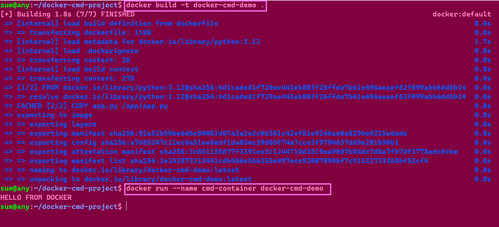

# 🐳 Docker CMD Project

A simple Docker project to understand how `Dockerfile`, `Image`, `Container`, and `CMD` work together.

## 📁 Project Structure

    docker-cmd-project/
    ├── Dockerfile
    └── app.py

---

## 1. 📂 Create the Project Directory

Create a new directory:

    mkdir docker-cmd-project

Enter the directory:

    cd docker-cmd-project

Check the current location:

    pwd

Check the files:

    ls

---

## 2. 🐍 Create the Python Application

Create the Python file:

    nano app.py

Add:

    print("Hello from Docker!")

Save the file.

Test the Python application:

    python3 app.py

Expected output:

    Hello from Docker!

---

## 3. 🐳 Create the Dockerfile

Create the Dockerfile:

    nano Dockerfile

Add:

    FROM python:3.12

    COPY app.py /app/app.py

    CMD ["python", "/app/app.py"]

---

## 4. 🔍 Understanding the Dockerfile

### 📦 FROM

    FROM python:3.12

Uses Python 3.12 as the base image.

Python does not need to be installed separately inside the container because the Python base image already contains Python.

### 📋 COPY

    COPY app.py /app/app.py

Copies the local `app.py` file into the image.

The first path is the file on the host.

The second path is where the file will be placed inside the image.

### ▶️ CMD

    CMD ["python", "/app/app.py"]

Defines the default command that runs when the container starts.

It is equivalent to:

    python /app/app.py

The important difference:

    RUN = executes while building the image
    CMD = executes when the container starts

---

## 5. 🔨 Build the Docker Image

Build the image:

    docker build -t docker-cmd-demo .

### 🔎 Understanding the Command

    docker build
    -t docker-cmd-demo
    .

`docker build` → builds a Docker image.

`-t docker-cmd-demo` → gives the image the name `docker-cmd-demo`.

`.` → uses the current directory as the Docker build context.

The directory contains:

    Dockerfile
    app.py

Check the image:

    docker images

---

## 6. 🚀 Run the Container

Run the image:

    docker run --name cmd-container docker-cmd-demo

Here:

    docker run → creates and starts a container
    --name cmd-container → gives the container its own name
    docker-cmd-demo → specifies the image to use

Expected output:

    Hello from Docker!

---

## 7. 🏷️ Image Name vs Container Name

This is an important Docker concept.

Our image is:

    docker-cmd-demo

Our container is:

    cmd-container

They are different things.

The relationship is:

    IMAGE
    docker-cmd-demo
          ↓
          ↓ docker run
          ↓
    CONTAINER
    cmd-container

The image is the template.

The container is the running instance created from that image.

---

## 8. 🔎 Check the Container

Show running containers:

    docker ps

Since our Python program finishes immediately, the container will stop.

Show all containers, including stopped ones:

    docker ps -a

You should see something similar to:

    IMAGE              NAMES
    docker-cmd-demo    cmd-container

📸 Screenshot: Add a screenshot of `docker ps -a` showing the image name and container name here.

---

## 9. 🔁 Run the Same Image Again

You can create another container from the same image:

    docker run --name cmd-container-2 docker-cmd-demo

Now we have:

    IMAGE
    docker-cmd-demo
         │
         ├── CONTAINER
         │   cmd-container
         │
         └── CONTAINER
             cmd-container-2

One image can be used to create multiple containers.

---

## 10. 🔄 Complete Docker Flow

The complete process is:

    app.py
       ↓
    Dockerfile
       ↓
    docker build
       ↓
    Docker Image
       ↓
    docker run
       ↓
    Docker Container
       ↓
    CMD executes
       ↓
    python /app/app.py
       ↓
    Hello from Docker!

---

---

## 12. 📝 Key Notes

📌 `Dockerfile` = instructions for building an image.

📌 `Image` = template used to create containers.

📌 `Container` = running or stopped instance of an image.

📌 `docker build` = creates an image.

📌 `docker run` = creates and starts a container.

📌 `CMD` = default command executed when the container starts.

📌 `--name` = gives the container a custom name.

📌 `-t` = gives the image a name/tag.

📌 `.` = current directory/build context.

### 🧠 Remember

    RUN  → Build Time
    CMD  → Container Start Time

And:

    IMAGE NAME     ≠     CONTAINER NAME

Example:

    docker run --name cmd-container docker-cmd-demo
                    ↑                 ↑
              Container Name      Image Name

---

## 🎯 Final Concept

    Dockerfile
         ↓
    🏗️ Build
         ↓
    🖼️ Image
         ↓
    🚀 Run
         ↓
    📦 Container
         ↓
    ▶️ CMD
         ↓
    🐍 Python Application