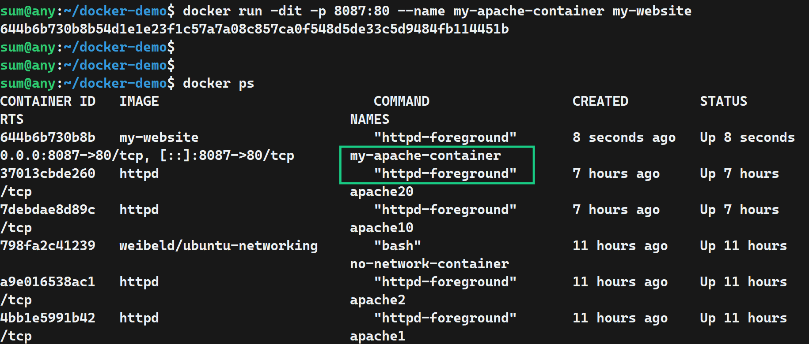

# 🐳 Dockerfile with Apache

## 📁 1. Create Project Folder

    mkdir docker-demo
    cd docker-demo

## 🌐 2. Create HTML File

    nano index.html

Add:

    <!DOCTYPE html>
    <html>
    <head>
        <title>Docker Apache Demo</title>
    </head>
    <body>
        <h1>Hello from Docker!</h1>
        
This website is running inside an Apache Docker container.

    </body>
    </html>

.png>)

## 📝 3. Create Dockerfile

    nano Dockerfile

Add:

    FROM httpd:latest

    COPY index.html /usr/local/apache2/htdocs/index.html

    EXPOSE 80

### 🔍 Dockerfile Instructions

| Instruction | Meaning |
|---|---|
| `FROM httpd:latest` | Uses the Apache HTTP Server image |
| `COPY` | Copies `index.html` into Apache's web directory |
| `EXPOSE 80` | Documents Apache's container port |

.png>)

## 📂 4. Project Structure

    docker-demo/
    ├── Dockerfile
    └── index.html

## 🔨🖼️ 5. Build and Check the Image

    docker build -t my-apache .

`-t my-website` gives the image a name.

`.` tells Docker to use the current directory as the build context.
    
    docker images 

 This shows the `my-website` image created from the Dockerfile.

## 🚀 6. Run the Container and check it

    docker run -d -p 8087:80 --name apache-container my-apache

### 🔗 Port Mapping

    8080:80
       │ │
       │ └── Container port
       └──── Host port

The host's port `8087` is connected to Apache's port `80` inside the container.

    docker ps

This confirms that the Apache container is running.

## 🌍 7. Open the Website

Open in your browser:

    http://localhost:8087

Apache will serve the `index.html` file from inside the container.

## 🔄 10. Docker Flow

    Dockerfile
        ↓
    docker build
        ↓
    Docker Image
        ↓
    docker run
        ↓
    Docker Container
        ↓
    Apache Web Server
        ↓
    localhost:8087

## 📌 Summary

    Dockerfile → Build → Image → Run → Container → Apache → Website

The Dockerfile provides the instructions, the image packages those instructions, and the container runs Apache using that image.